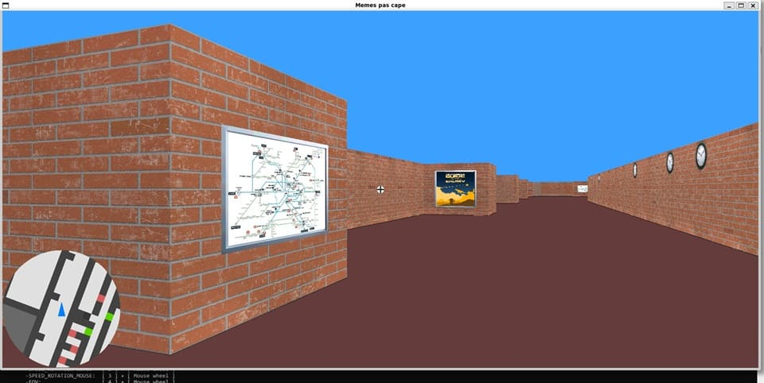
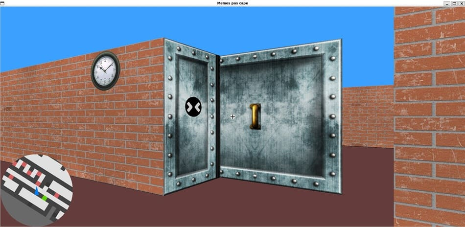

<h1 align="center">cub3D</h1>

<p align="center">
  
  
  
  
</p>

<p align="center">
  
</p>

<p align="center"><strong>A Wolfenstein-style raycasting engine written in C, where the only thing the graphics library gives you is a pixel buffer.</strong></p>

---

## 📌 Overview

In 1992, Wolfenstein 3D put a convincing first-person world on machines with no graphics hardware to speak of, and it did it by cheating brilliantly: nothing on screen is really 3D. The world is a flat grid of characters, and every frame is built by casting one ray per screen column and drawing whatever it hits as a single vertical strip of pixels.

Cub3D rebuilds that engine in C from an empty file. The 42 subject keeps the original's constraints down to the flat, untextured floor and ceiling, which leaves nowhere to hide: get the trigonometry right and the walls stand straight, get it subtly wrong and every corridor bends as you turn.

MiniLibX opens a window and lets you set individual pixels, everything above that we wrote ourselves, from the projection and the wall texturing down to the animation timing and the memory management.

The rendering was the visible part of the problem. The part I actually spent my time on was the shape of the code. A raycaster gets messy fast, so I split my side of it into modules with one responsibility each, gave every module its own header and its own function prefix, and pushed every tunable value into a single configuration header. The result is a codebase where the render path, the game logic and the input handling can be read and changed independently.

## 👥 Team

A two-person project, built with [Alexandre](https://github.com/alex6656). He wrote the `.cub` parsing and map validation, I took the gameplay and the rendering, and the first working version of the raycasting we derived and built together before I refined it.

The module boundaries described below are partly a consequence of that split. Agreeing early on where parsing hands the world over to the engine, and on what a map chunk looks like in memory, is what let us work in the same repository without waiting on each other.

## 🎯 Objectives

- Work out the raycasting math from first principles, including the wall-hit search, the projection to screen height and the texture column lookup.
- Keep rendering, gameplay, input and map parsing genuinely separate, so a change in one does not force a change in the others.
- Make features configurable at compile time rather than duplicating code paths, with a mandatory build and a bonus build sharing the same sources.
- Parse `.cub` map files defensively, rejecting every malformed input with a clear message instead of crashing.
- Ship with no memory leaks and no leaked file descriptors under Valgrind.

## 🖼️ Gallery

<p align="center">
  
</p>

Doors open and close on an animation timer and are raycast as their own surface. The minimap is colours them green when open and red when closed. The clock on the left wall and the schedule board in the first screenshot are animated textures, cycling through frames on their own timer.

## 🕹️ Beyond the subject

The subject asks for textured walls, keyboard movement and a parser that refuses bad input.
Doors and a minimap are the suggested bonuses. Everything below is ours, and it is the part of the project we had the most fun arguing about.
To test them with optimal conditions try our special map: `make run_bonus ARGS="maps/valid/final_bonus_all.cub"`

### Buttons on the walls you can click
> Hum, should I really click on that?

Some panels have buttons. Line one up in the crosshair, click or press space, and an animation plays on your screen.
The two we shipped are named `leaks` and `crashes`, after the two things most likely to sink a 42 project, which makes walking into one a running joke rather than a feature.

<!-- TODO: clip or screenshot of a leaks/crashes wall firing -> readme_img/props.gif -->

### Walls that are not there.
> I swear there was a wall here!

A hologram block renders exactly like solid masonry and then lets you walk straight through it.
It works because the engine keeps two separate notions of what counts as an obstacle, one for rays and one for footsteps:

```c
#  define CHARS_OBSTACLE_RAYCASTING "12lkjhcvbxp " //apear as solid block with visible textures
#  define CHARS_OBSTACLE_WALK       "12lkjhcvbx " //can't be walked through
```

The `p` is the symbol of the hologram in the map file. Its presence in the first list and its absence from the second is the whole trick. It is also the clearest argument for having kept rendering and collision apart in the first place.

<!-- TODO: clip walking through a hologram wall -> readme_img/hologram.gif -->

### Animated textures
> Its alive !

A static texture is good for a classic wall but it lacks life. In animated textures, a texture is a directory of frames rather than a single picture, with a `frames_data.txt` next to them giving the frame delay and the pause before the cycle restarts.
Example with the map `maps/valid/final_bonus_all.cub`:
- the clocks run on sixty frames a second apart, so their hands actually sweep
- the train departure boards cycle ten frames then hold for five seconds. Neither needed a line of code of its own.

### Settings you change mid-game
> If only I could go faster...

Do you want to have custom walk speed, key rotation speed, mouse sensitivity, field of view and minimap zoom ?
Press a number key to pick the setting, then turn the mouse wheel (or press on it to reset). Pressing `h` will show you which commands are available.
It started as a way to stop rebuilding after every tweak while tuning the feel of the movement, and it stayed and got improved because it makes the engine pleasant to demo.

<!-- TODO: clip of FOV being swept with the mouse wheel -> readme_img/settings.gif -->

## 🧠 How the rendering works

For each of the 1900 screen columns, the engine casts one ray from the player and looks for the first wall it meets. 

The hit point that comes back carries which face was struck and where along that face the ray landed. That is enough for `raycasting/` to pick the right texture column, scale it to the projected wall height and write the pixels. Doors add a second, offset surface inside the same grid cell, so the door tests live in their own file rather than as special cases scattered through the wall code.

**Want more details ?**
Rather than running a single generic stepping loop, the ray's angle is first classified into one of eight angular sectors (`N_NE`, `NE_E`, `E_SE`, and so on). That classification fixes the sign of every step and decides which axis is the primary one, so the inner loop that walks the grid intersections has no direction branching left in it. Each sector has its own collision routine, dispatched through a function pointer table:

```c
typedef t_hitpoint	(*t_collision_function)(t_general*, t_hitpoint, t_ray_data);
```


The geometry behind all of this was worked out on paper first. The GeoGebra constructions we built while deriving it are kept in [`geogebra/`](geogebra/).

## ⚙️ Configuration

Everything tunable lives in [`includes/settings.h`](includes/settings.h):
window size, default and clamped FOV, walk and rotation speeds with their increment steps, minimap sizing and zoom, door timing, minimap colours, and the key bindings as an enum of X11 keysyms.
Changing a control or the field of view is a one-line edit, not a search through the source.
A subset of the same parameters can also be adjusted while playing, by selecting one with a number key and turning the mouse wheel.

The bonus features are compiled in rather than switched on at runtime.
`make bonus` adds `-D BONUS`, which pulls in doors, animated textures, mouse look, the world map, the hologram walls and the clickable panels. The data structures themselves differ between the two builds: `t_ray_data` only carries door state in the bonus build, so the mandatory binary is not paying for a feature it does not have.
Because mixing object files from the two modes would be silently wrong, the Makefile records the current mode in `obj/.state` and forces a full rebuild when it changes.


## 🛠️ Tech Stack

<p>
  
  
  
  
</p>

C compiled with `-Wall -Wextra -Werror`, GNU Make, and MiniLibX over X11.
The Makefile clones MiniLibX at a pinned commit and builds it, so there is nothing to install by hand beyond the X11 development headers.

## 🚀 Getting Started

```bash
git clone https://github.com/acardona123/42_Cub3D.git
cd 42_Cub3D
make bonus
```

Use `make` instead for the mandatory build (textured walls, keyboard movement, no doors or animation).

## 📖 Usage

```bash
./cub3D maps/valid/final_bonus_all.cub     # bonus, requiere make bonus
./cub3D maps/valid/subject_mandatory.cub   # mandatory build, requiere make but is compatible with make bonus
```

`make run ARGS=<map>` and `make run_bonus ARGS=<map>` build and launch in one step.

### Controls

| Action                                                | Key                              |
| ----------------------------------------------------- | -------------------------------- |
| Move                                                  | `W` `A` `S` `D`                  |
| Turn                                                  | `←` `→` or the mouse             |
| Sprint                                                | `Left Shift`                     |
| Interact with a door or a wall prop                   | `Space` or left click            |
| World map                                             | `M`                              |
| On-screen help                                        | `H`                              |
| Adjust walk speed, rotation speeds, FOV, minimap zoom | `1` to `5`, then the mouse wheel |
| Quit                                                  | `Esc`                            |

### Map format

A `.cub` file declares its textures and colours, then the grid.

Textures are given as:
- static texture : `.xpm` file
- animated texture (bonus only) : a *directory*, not a file. Drop several `.xpm` frames in, with a `frames_data.txt` holding the frame delay and the pause before the cycle restarts. Adding an animated wall therefore needs no code change at all.

```
NO ./textures/final_textures/walls/wall_enlighted
SO ./textures/final_textures/walls/wall_enlighted
WE ./textures/final_textures/walls/wall_shadow
EA ./textures/final_textures/walls/wall_shadow
F 100,60,60
C 60,160,255

1111111111
1000000001
10001d0001
1000000W01
1111111111
```

Grid characters, in the bonus build:

| Char            | Meaning                                                    |
| --------------- | ---------------------------------------------------------- |
| `0`             | Floor                                                      |
| `1` `2`         | Wall, using the main or the alternate texture set          |
| `d`             | Door                                                       |
| `N` `E` `S` `W` | Player spawn and starting orientation                      |
| `l` `k` `j` `h` | Clickable `leaks` panel, facing north, east, south or west |
| `c` `v` `b` `x` | Clickable `crashes` panel, same four facings               |
| `p`             | Hologram wall, solid to rays but not to footsteps          |

The mandatory build accepts `0`, `1`, spaces and the four spawn characters only.

## 🧪 Tests

Parsing is the part of this project that fails in the most ways, so it is the part the project tests hardest.
[`maps/not_valid/`](maps/not_valid/) holds around forty deliberately broken maps: unclosed maps in every direction, missing or duplicated texture keys, malformed RGB values, corrupted and non-.xpm texture files, zero players, two players, illegal characters, empty lines inside the grid. Each one has to produce an error message rather than a crash.

We defined the cases together, one map per failure we could think of. Checking them meant launching each one by hand, which stopped scaling quickly, so I wrote the shell script in [`invalid_map_tester/`](invalid_map_tester/) to run the whole set in one pass and confirm every map is rejected. It is also published on its own as [42_tester_cub3d_parsing](https://github.com/acardona123/42_tester_cub3d_parsing), so other students can point it at their own binary.

Memory was checked with `make check ARGS=<map>` and `make check_bonus ARGS=<map>`, which run Valgrind with full leak checking, origin tracking and file descriptor tracking. MiniLibX leaks one allocation in `mlx_mouse_hide` that no caller can free, so the Makefile generates a targeted suppression file for exactly that symbol instead of ignoring the report wholesale.

## 📁 Structure

```
src/
├── init/            map parsing, texture pack loading, world build, input hooks
├── ray_collision/   ray-to-wall search, one routine per angular sector
├── raycasting/      frame assembly, texture column lookup, pixel colour
├── gameplay/        movement, head turning, interactions
├── maps/            minimap and full world map rendering
├── shared/          state touched by more than one module
├── tools/           vectors, angles, timing, lists, image and file helpers
└── end_destroy/     teardown of every allocation, in reverse order
includes/            one header per module, all built on shared.h
maps/                valid maps and the invalid-map test corpus
textures/            .xpm textures and animation frame data
geogebra/            the raycasting geometry, worked out
```

## 📚 Resources

- [MiniLibX](https://github.com/42Paris/minilibx-linux), the X11 wrapper the project builds on
- [raycasting wiki](https://en.wikipedia.org/wiki/Ray_casting), understand what raycasting is
- [42_tester_cub3d_parsing](https://github.com/acardona123/42_tester_cub3d_parsing), the parsing tester extracted from this repo

---

<p align="center"><sub>🏫 Project from the <strong>42</strong> common core, School 42 Paris.</sub></p>
